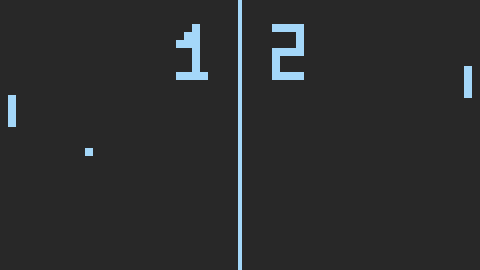

# Pong

[Well, hello there !](https://www.youtube.com/watch?v=rEq1Z0bjdwc&t=8)

You probably know this game.

I just wanted to practice C for gamedev. This project will most likely evolve over time. I may end up doing some stupid stuff like make a render engine using Vulkan ?



## Dependencies

### Tools
- Linux
- make
- gcc

### libraries
- SDL2

## How to build and run

- run the ```./run``` script

OR

- ```make```
- ```bin/pong```

## How to play

- Left player uses the 'E' and 'D' keys to go up and down respectively
- Right players uses the up and down arrows, to go up and down.
- You can transfer your paddle's inertia to the ball.
- The ball goes a little faster everytime it touches a paddle.
